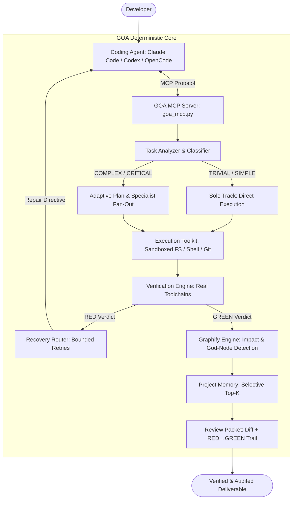

# Graph Agent Orchestrator (GOA)

[](https://www.python.org/downloads/)
[](https://github.com/langchain-ai/langgraph)
[](https://modelcontextprotocol.io/)
[](https://github.com/arminakb/GAO/actions/workflows/ci.yml)
[](LICENSE)

> **GOA = the intelligence and orchestration layer that makes Claude Code, Codex, and other coding agents better — without replacing them.**

---

## 1. What GOA Is & Why It Exists

**Graph Agent Orchestrator (GOA)** is a production-grade **Intelligent Task-Adaptive Orchestrator**.

Coding agents (Claude Code, Codex, OpenCode, Cursor) excel at code synthesis, but commonly suffer from three fundamental bottlenecks in real-world repositories:
1. **Hallucinated Verification:** Claiming "all tests pass" without executing real checks or understanding build toolchains.
2. **Unbounded Failure Loops:** Retrying aimlessly when encountering complex build, lint, or runtime errors.
3. **Rigid Over-Orchestration:** Burning tokens on multi-agent planning loops for trivial edits and typo fixes.

**GOA does not write your code.** Your existing coding agent remains the execution engine. GOA sits over the standard **Model Context Protocol (MCP)** to provide deterministic intelligence:
- **How much orchestration does this task actually deserve?** *(Solo execution vs. planning vs. specialist fan-out)*
- **Did the toolchain really pass?** *(GOA executes real pytest, mypy, and linter toolchains mechanically)*
- **What is the architectural blast radius?** *(Graphify static analysis for dependency impact and god-node detection)*
- **How should failures be recovered?** *(Deterministic error classification routing to bounded repair loops)*
- **What was learned in previous sessions?** *(Project-level memory with selective relevance retrieval)*

In its primary mode, **GOA requires zero additional LLM provider API keys or separate credentials.**

---

## 2. Architecture Design

GOA operates primarily as an MCP intelligence layer on top of external coding agents (Mode A), with an optional secondary standalone LangGraph execution engine (Mode B).

### System Architecture Diagram



### Two Execution Modes

| Dimension | Mode A: External Agent Mode (PRIMARY) | Mode B: Native GOA Mode (SECONDARY) |
|---|---|---|
| **Role** | Intelligence & verification layer | Standalone multi-agent graph |
| **Execution Engine** | Claude Code / Codex / OpenCode | GOA LangGraph agents (`coder`, `architect`, etc.) |
| **API Keys** | **None required** (uses existing agent credentials) | Required (`LLM_PROVIDER`, `LLM_MODEL`) |
| **Interface** | FastMCP stdio server (`skills/servers/goa_mcp.py`) | Python API (`harness/validator.py::run_graph`) |
| **Orchestrator Cost** | **0 extra LLM calls** on simple/solo tasks | Per-agent LLM invocations |

---

## 3. How GOA Compares

GOA was evaluated against baseline solo coding agents and the [Everything Claude Code (ECC)](https://github.com/affaan-m/ecc) methodology:

| Feature | Solo Coding Agent | [ECC Harness](https://github.com/affaan-m/ecc) | GOA Orchestrator |
|---|:---:|:---:|:---:|
| **Execution Engine** | Coding agent alone | Coding agent alone | Coding agent (Primary) / Native graph |
| **Task-Adaptive Depth** | None | Manual workflow selection | **Automatic, deterministic, measured** |
| **Verification Authority** | Agent prose claims | Prompt-level self-discipline | **GOA executes toolchains mechanically** |
| **Error Recovery** | Unbounded model guess | Workflow markdown guidance | **Deterministic category → resolver routing** |
| **Budget Enforcement** | Prompt requests | Prompt requests | **Hard programmatic code ceilings (max 3 cycles)** |
| **Architecture Intelligence** | Context window search | Skills documentation | **Graphify dependency & god-node queries** |
| **Extra API Key Cost** | 0 | 0 | **0 (Mode A)** |

---

## 4. Benchmark Results (Prominently Highlighted)

The benchmark evaluated **Solo vs [ECC](https://github.com/affaan-m/ecc) vs GOA Orchestrator** on 24 completed runs across 3 software engineering domains (**Backend, Frontend, Database**) on fresh, isolated sandboxes using OpenCode (`opencode/muse-spark-1.2-contributor-free`) with automated mechanical verification gates:

### Comprehensive Results (N=24 Runs)

| Metric | Solo (Bare Agent) | [ECC](https://github.com/affaan-m/ecc) (Checklist Prompt) | GOA Orchestrator (Adaptive) |
|---|:---:|:---:|:---:|
| **Clean Sweep (Tests + Lint + Types)** | 0.0% (0/8) | 0.0% (0/8) | **75.0% (6/8)** |
| **Unit Tests Pass Rate** | 75.0% (6/8) | **87.5% (7/8)** | **87.5% (7/8)** |
| **Lint Pass Rate (Ruff/ESLint)** | 0.0% (0/8) | 25.0% (2/8) | **75.0% (6/8)** |
| **Typecheck Pass Rate (Mypy/TSC)** | 62.5% (5/8) | 37.5% (3/8) | **75.0% (6/8)** |
| **Composite Quality Score (0–10)** | 6.50 ± 4.07 | 7.12 ± 3.00 | **8.38 ± 3.54** |
| **Mean Duration (s)** | **115.7s** | 549.0s (Median 131s) | 136.4s (Median 129s) |
| **Average Guided Repair Retries** | 0.00 | 0.00 | **0.88** |

### Key Benchmark Takeaways
1. **Multi-Gate Enforcement Beats Prompt Hope:** Neither Solo nor ECC produced a single build that passed unit tests, linter, and strict type-checker simultaneously (**0% clean sweep**). GOA achieved **75.0% clean sweep** through its closed-loop repair feedback.
2. **Code Budgets Prevent Runaway Loops:** While ECC encountered an unconstrained 3600s timeout loop on Database Seed 2, GOA's code-level budget (`GOA_MAX_VERIFY_CYCLES = 3`) bounded repair retries to an average of **0.88 cycles**.

*Full benchmark dataset, methodology, and domain analyses are documented in [docs/BENCHMARK.md](docs/BENCHMARK.md).*

---

## 5. Quick Start

### Installation

```bash
git clone https://github.com/arminakb/GAO.git
cd GAO
uv sync            # or: pip install -e .
```

### Connecting to Your Coding Agent

Run the CLI initialization helper to generate ready-to-paste configurations:
```bash
python goa_cli.py --workspace /path/to/your/project init
```

#### Claude Code
```bash
claude mcp add goa -- /path/to/GAO/.venv/bin/python \
    /path/to/GAO/skills/servers/goa_mcp.py --workspace /path/to/your/project
```

#### OpenAI Codex (`~/.codex/config.toml`)
```toml
[mcp_servers.goa]
command = "/path/to/GAO/.venv/bin/python"
args = ["/path/to/GAO/skills/servers/goa_mcp.py", "--workspace", "/path/to/your/project"]
```

#### OpenCode (`opencode.json`)
```json
{
  "mcp": {
    "goa": {
      "type": "local",
      "command": {
        "command": "/path/to/GAO/.venv/bin/python",
        "args": ["/path/to/GAO/skills/servers/goa_mcp.py", "--workspace", "/path/to/your/project"]
      }
    }
  }
}
```

---

## 6. Example Workflows

### Example 1: Simple Task (Solo Track)
```text
Task: "Fix typo in docstring of helper function"
   ↓
goa_analyze_task → Classification: TRIVIAL (Confidence: 0.95)
   ↓
goa_route        → Track: "solo", Steps: ["implement", "verify"]
   ↓
Agent executes edit directly (0 extra orchestrator LLM calls)
   ↓
goa_verify       → Executes pytest + ruff mechanically → GREEN
   ↓
Done (Zero overhead, immediate completion)
```

### Example 2: Complex Task with Failure Recovery & Architectural Review
```text
Task: "Refactor inventory schema with raw-SQL constraints and atomic fulfillment"
   ↓
goa_analyze_task → Classification: COMPLEX, Risk: HIGH, Blast Radius: "high"
   ↓
goa_route        → Track: "complex", Steps: ["plan", "specialists", "implement", "verify", "review"]
   ↓
Agent implements schema and data layer
   ↓
goa_verify       → Runs pytest → RED (`test_failure`: non-atomic fulfillment violation)
   ↓
goa_repair       → Routes to `test_failure_resolver` with smart-excerpted failure traceback
   ↓
Agent applies targeted fix
   ↓
goa_verify       → Re-runs pytest + mypy + ruff → GREEN
   ↓
goa_get_impact   → Queries Graphify graph; detects touch on god-node `InventoryService`
   ↓
goa_review       → Evaluates git diff + RED→GREEN audit trail → APPROVE-eligible
   ↓
Verified Result (Audit trail recorded in session history)
```

---

## 7. Cost Model & Token Optimization

GOA is designed for **total task cost reduction**:
- **Deterministic-First Analysis:** Rule-based heuristics classify tasks without LLM calls.
- **Smart Excerpting (`smart_excerpt`):** Relevancy-preserving text excerpting retains both command headers and tail error tracebacks while truncating repetitive middle output.
- **Programmatic Ceilings:** Enforces `GOA_MAX_VERIFY_CYCLES = 3` and token bounds in code.

---

## 8. Documentation Index

- [docs/FINAL_REPORT.md](docs/FINAL_REPORT.md) — Comprehensive 14-section final project report
- [docs/BENCHMARK.md](docs/BENCHMARK.md) — Live Phase 8 benchmark methodology, datasets, and domain breakdown
- [docs/ARCHITECTURE.md](docs/ARCHITECTURE.md) — Deep architectural specification and security model
- [docs/MCP.md](docs/MCP.md) — Full MCP tool reference and agent connection guide
- [docs/VERIFICATION.md](docs/VERIFICATION.md) — Toolchain discovery, evidence model, and recovery routing
- [docs/AGENT_MODEL.md](docs/AGENT_MODEL.md) — Agent catalog and capability enforcement
- [docs/COST_OPTIMIZATION.md](docs/COST_OPTIMIZATION.md) — Cost model and context engineering
- [docs/MEMORY.md](docs/MEMORY.md) — Selective engineering memory retrieval
- [docs/GRAPHIFY.md](docs/GRAPHIFY.md) — Architectural graph analysis and god-node detection
- [docs/AUDIT.md](docs/AUDIT.md) — Architectural audit and design foundation

---

## 9. Development & Testing

```bash
# Run the 170-test test suite
uv run pytest tests/ -q

# Verify linting and formatting
uv run ruff check .
uv run ruff format --check .

# Static type checking
uv run mypy harness skills scripts goa_cli.py

# End-to-end live external mode verification demo
python scripts/e2e_external_mode.py
```

---

## 10. License

This project is licensed under the MIT License — see the [LICENSE](LICENSE) file for details.
